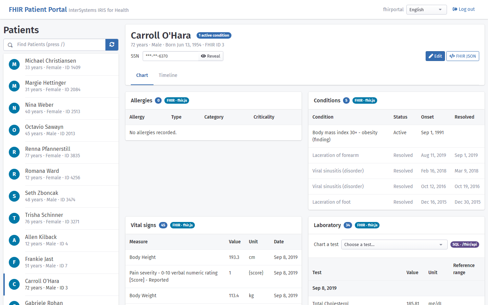
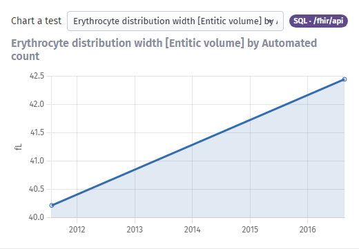
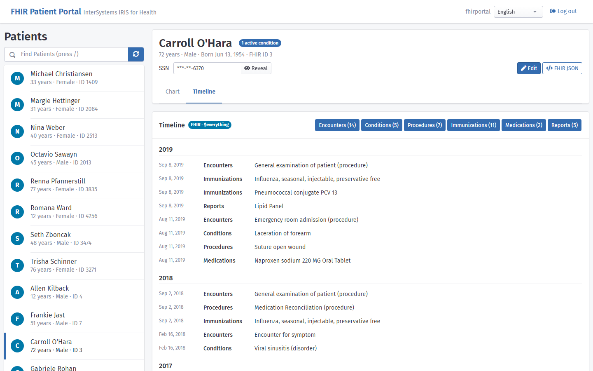
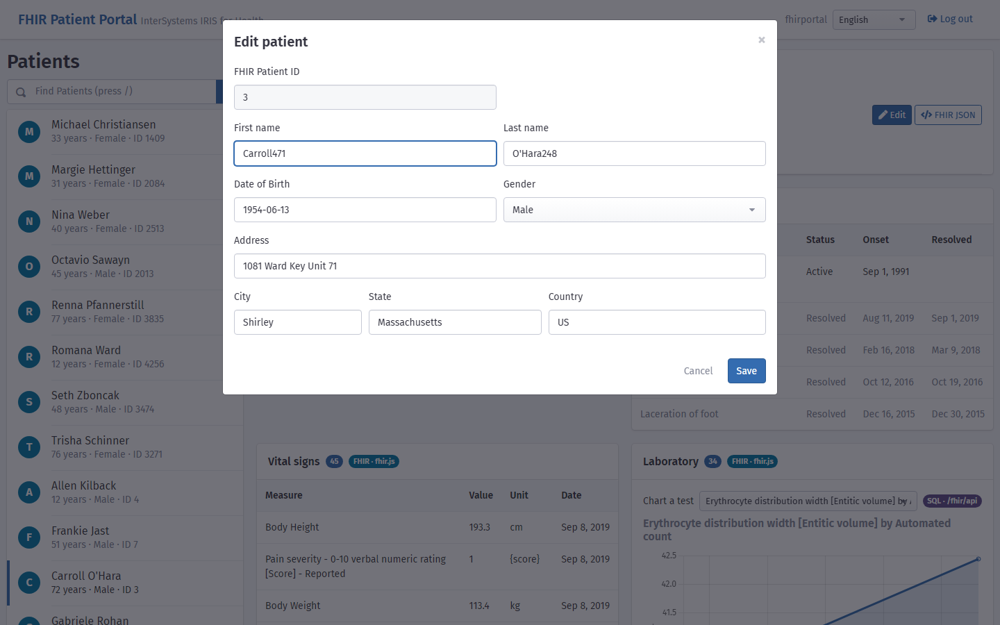
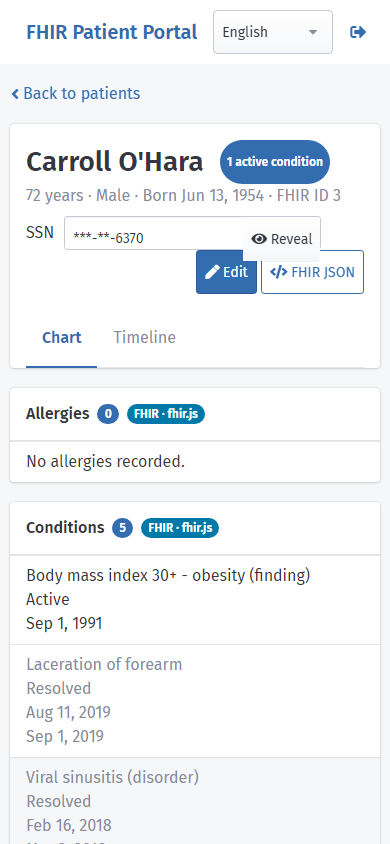
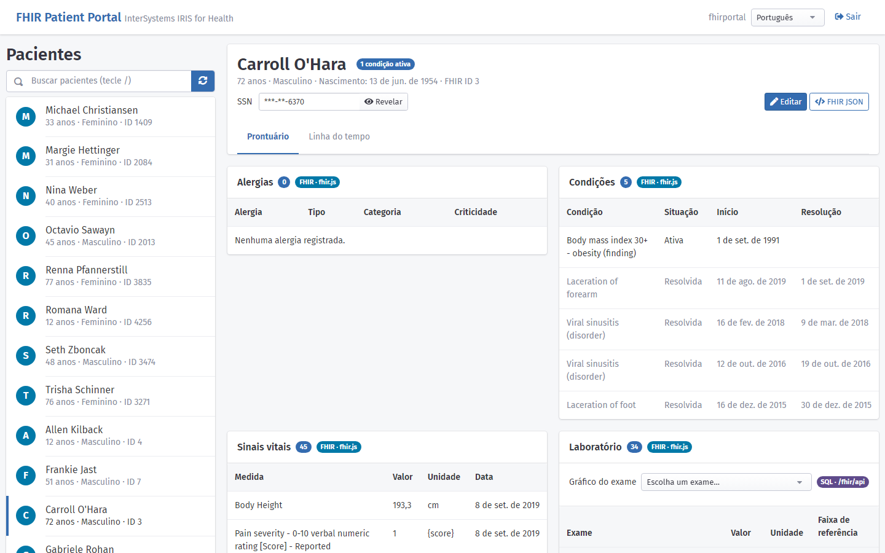

# IRIS FHIR Portal

[](https://github.com/diashenrique/iris-fhir-portal/actions/workflows/ci.yml)

A patient chart built on the FHIR server of InterSystems IRIS for Health. It shows how far you can get with FHIR REST, the SQL view of the FHIR resources and `Patient/$everything`, and it is the companion of four articles on the InterSystems Developer Community (see [Articles](#articles)).



## Prerequisites
Make sure you have [git](https://git-scm.com/book/en/v2/Getting-Started-Installing-Git) and [Docker desktop](https://www.docker.com/products/docker-desktop) installed.

## Installation 

Clone/git pull the repo into any local directory

```
$ git clone https://github.com/diashenrique/iris-fhir-portal.git
```

Open the terminal in this directory and run:

```
$ docker compose up -d
```

The image is built on `intersystems/irishealth-community:latest-cd` (InterSystems IRIS for Health 2026.2), the same release channel used by [sentai-task](https://github.com/musketeers-br/sentai-task). The FHIR R4 server uses the JsonAdvSQL storage strategy, so its SQL schemas are `HSFHIR_X0001_R` and `HSFHIR_X0001_S`.

The portal requires a login. Open http://localhost:32783/fhir/portal/diashenrique.fhir.portal.Home.cls and sign in as the demo user `fhirportal` / `fhirportal` (no roles), created during the build. One IRIS session then covers the pages, the FHIR endpoint `/fhir/r4` and the REST API `/fhir/api`; the Logout link at the top ends it. Do not expose this container outside your machine.

## Checking your Docker installation

CI runs these checks on every pull request and push to master. To run them against your local container (Docker Compose setup only; set `BASE_URL` for both if you changed the port, default `http://localhost:32783`):

```
$ bash scripts/smoke.sh
```

signs in and checks the FHIR server, the `/fhir/api` REST routes, both pages, and that nothing answers without a login or after logout. `bash scripts/check-readonly.sh` checks that the roles of `/fhir/api` can read the FHIR tables and cannot write to them, and `bash scripts/check-readme-sql.sh` runs the SQL examples of the documentation. The browser tests need [Node.js](https://nodejs.org/) 22 or later. They sign in and go through the list, the chart, Edit, the lab chart, the Timeline, the languages and logout; the data they create or change is removed or restored at the end:

```
$ cd e2e
$ npm ci
$ npx playwright install chromium
$ npx playwright test
```

On a fresh Linux machine, use `npx playwright install --with-deps chromium` to also get the browser's system libraries.

The frontend libraries come from npm through `vendor/` (see [vendor/README.md](vendor/README.md) and [vendor/INVENTORY.md](vendor/INVENTORY.md)). CI checks that the files in `fhirUI/assets/vendor` match the lockfile and runs `npm audit` on them. To run the same check locally: `cd vendor && npm ci --ignore-scripts && node sync.mjs --check`.

## Installation via IPM

The portal needs IRIS for Health with a FHIR R4 server at `/fhir/r4` that uses the JsonAdvSQL storage strategy, for example the `fhir-server` package of [iris-fhir-template](https://github.com/intersystems-community/iris-fhir-template). Install the portal in the namespace of that server, after it:

```
zn "FHIRSERVER"
zpm "install fhir-portal"
```

The module (version 1.1.0 or later) creates everything the Docker setup has, through `diashenrique.fhir.portal.Installer`:
- the web apps `/fhir/portal` and `/fhir/api`, both with password login;
- one session shared with `/fhir/r4`;
- the roles `FHIRPortalRead` (read-only FHIR databases) and `FHIRPortalAPI` (SELECT on the endpoint's SQL schemas and EXECUTE on the JSON SQL functions).

The Docker image installs the portal through the same module.

Open `http://your-server:port/fhir/portal/diashenrique.fhir.portal.Home.cls` and sign in with an IRIS user. To also create the demo login `fhirportal` / `fhirportal`, pass the module parameter. With IPM 0.10, the `-Dzpm.` form does not reach the module:

```
zpm "install fhir-portal -DDemoUser=1"
```

Installed in a namespace without `/fhir/r4` (for example `USER`, before the FHIR server exists), the module only prints a warning and configures nothing. `zpm "uninstall fhir-portal"` removes the two web apps, the roles and the demo user. The session settings stay on `/fhir/r4`.

On IRIS for Health 2026.2, `fhir-server` 1.3.7 fails when it creates the FHIRSERVER namespace itself. `scripts/ipm-install.sh` shows the workaround CI uses: create the namespace first and map IPM into it. To check the whole IPM path in a clean container on port 42783:

```
$ bash scripts/ipm-install.sh
$ BASE_URL=http://localhost:42783 bash scripts/smoke.sh
```

## How the portal reads FHIR data

The portal reads the same FHIR data three ways, and every card says which one it uses:

- **FHIR REST with [fhir.js](https://github.com/FHIR/fhir.js)** (badge *FHIR · fhir.js*): the patient list, the summary and the clinical cards search `/fhir/r4`, and Edit saves the patient with a FHIR `update`. These are articles 1 to 3.
- **SQL through `/fhir/api`** (badge *SQL · /fhir/api*): the lab chart. The REST class `diashenrique.fhir.portal.Dispatch` runs SQL on the tables of the FHIR server, with the JSON functions `GetJSON`, `GetProp` and `GetAtJSON` of article 4 (`src/User/SQLvar.cls`). It asks the storage strategy of `/fhir/r4` for the table names, and the role of `/fhir/api` can only read them.
- **`Patient/$everything`** (badge *FHIR · $everything*): the Timeline, from one call.

The FHIR server uses the JsonAdvSQL storage strategy: `HSFHIR_X0001_R.Rsrc` holds every resource as JSON, and `HSFHIR_X0001_S.<Resource>` holds its search parameters. These are the queries of `/fhir/api`, with a sample patient in place of the `?` parameter.

The lab tests of a patient, for the chart picker (`GET /fhir/api/laboptions/:id`):

```sql
SELECT DISTINCT
  GetProp(GetJSON(GetAtJSON(GetJSON(GetJSON(r.ResourceString,'code'),'coding'),0),'code'),'code') AS testCode,
  GetProp(GetJSON(GetAtJSON(GetJSON(GetJSON(r.ResourceString,'code'),'coding'),0),'display'),'display') AS testName
FROM HSFHIR_X0001_S.Observation s
JOIN HSFHIR_X0001_R.Rsrc r ON r.Key = s.Key
WHERE s.patient_Reference = (SELECT TOP 1 patient_Reference FROM HSFHIR_X0001_S.Observation)
  AND r.ResourceType = 'Observation' AND r.Deleted = 0
  AND GetProp(GetJSON(GetAtJSON(GetJSON(GetJSON(r.ResourceString,'category'),'code'),0),'code'),'code') = 'laboratory'
ORDER BY testName
```

The results of one test, for the chart (`GET /fhir/api/patient/:id/lab/:code`, here LOINC 718-7, hemoglobin):

```sql
SELECT
  GetProp(GetJSON(GetAtJSON(GetJSON(GetJSON(r.ResourceString,'code'),'coding'),0),'display'),'display') AS testName,
  GetProp(GetJSON(r.ResourceString,'effectiveDateTime'),'effectiveDateTime') AS effectiveDateTimeValue,
  GetProp(GetJSON(r.ResourceString,'valueQuantity'),'value') AS valueQuant
FROM HSFHIR_X0001_S.Observation s
JOIN HSFHIR_X0001_R.Rsrc r ON r.Key = s.Key
WHERE s.patient_Reference = (SELECT TOP 1 patient_Reference FROM HSFHIR_X0001_S.Observation)
  AND r.ResourceType = 'Observation' AND r.Deleted = 0
  AND GetProp(GetJSON(GetAtJSON(GetJSON(GetJSON(r.ResourceString,'category'),'code'),0),'code'),'code') = 'laboratory'
  AND GetProp(GetJSON(GetAtJSON(GetJSON(GetJSON(r.ResourceString,'code'),'coding'),0),'code'),'code') = '718-7'
ORDER BY effectiveDateTimeValue
```

[misc/sql/example.sql](misc/sql/example.sql) has the step-by-step examples of article 4. CI runs every SQL example of this README, of README-JP and of that file against the FHIR server (`bash scripts/check-readme-sql.sh`), so they keep working.

## Using the portal

Open http://localhost:32783/fhir/portal/diashenrique.fhir.portal.Home.cls and sign in as `fhirportal` / `fhirportal`.

- **Patient list:** on the left, with age, sex and FHIR id. Type to search by name or id, or press `/` to get there; the arrow keys move through the list.
- **Summary:** choosing a patient shows who they are at the top, with the allergy alert and the count of active conditions. **Edit** opens the demographics in a modal and saves them with a FHIR `update` (article 3). **FHIR JSON** shows the raw Patient resource; the SSN stays masked until you choose **Reveal**.
- **Clinical cards:** always open, each with its count, the source of its data and its own loading, empty and error states. They are Allergies, Conditions, Medications, Vital signs (the latest value of each measure), Laboratory (grouped by day, with reference ranges and High or Low values flagged), Immunizations, Encounters and Care plans.

**Lab chart:** choose a test in the Laboratory card and its chart draws right there, with the unit and the reference range. The values come from SQL through `/fhir/api` (article 4).



**Timeline:** the **Timeline** tab lists every dated event of the patient (encounters, conditions, procedures, immunizations, prescriptions and reports) by year, from one call to `Patient/$everything`. Filter it by type.



**Edit:**



**On a phone:** the list and the chart take turns, and nothing scrolls sideways.



**Português:** the language picker in the header switches the interface to Brazilian Portuguese, dates and numbers included. Clinical data stays as the FHIR server sends it.



The screenshots come from `cd e2e && node screenshots.js`, with the container running.

## Articles

The portal was written for the 2020 FHIR contest and explained in four articles on the InterSystems Developer Community:

1. [My experience working with FHIR](https://community.intersystems.com/post/my-experience-working-fhir)
2. [Overview of iris-fhir-portal](https://community.intersystems.com/post/overview-iris-fhir-portal)
3. [Updating Patient resource using fhir.js](https://community.intersystems.com/post/updating-patient-resource-using-fhir-js)
4. [Getting FHIR information using SQL](https://community.intersystems.com/post/getting-fhir-information-using-sql)

They describe the portal of 2020. [iris-fhir-portal, six years later](https://community.intersystems.com/post/iris-fhir-portal-six-years-later-iris-health-2026-2-login-and-real-patient-chart) tells what changed since then, with errata for each of the four articles.

In short, since then it moved to IRIS for Health 2026.2 and the JsonAdvSQL schemas (`HSFHIR_X0001_*`), gained a login, a read-only `/fhir/api`, an IPM module and the layout above. [How the portal reads FHIR data](#how-the-portal-reads-fhir-data) has the current SQL.
